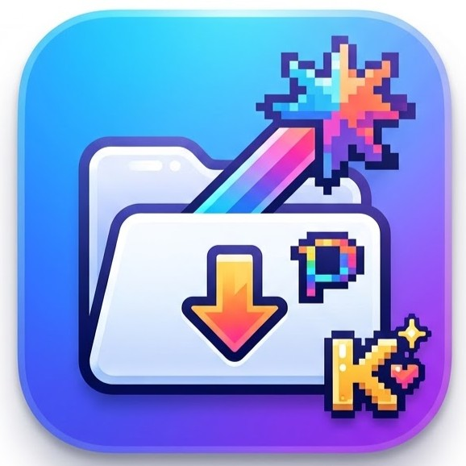

<div align="left">



# PixKura (蔵) — Version 2.3.2-V.31
### *by Kurito*

**A high-performance, memory-efficient desktop illustration vault, account-safe downloader & AI tag classifier for Pixiv artworks.**

[](https://www.python.org/)
[](https://riverbankcomputing.com/software/pyqt/)
[](https://github.com/microsoft/DirectML)
[](LICENSE)
[](#installation--setup)

[Key Features](#key-features) • [Architecture](#system-architecture--technical-workflow) • [Installation & Setup](#installation--setup) • [Quick Start](#first-time-quick-start) • [File Structure](#file-structure) • [Changelog](CHANGELOG.md) • [Future Roadmap](future_plan.md) • [Disclaimer](#disclaimer)

---
</div>

**PixKura (蔵)** is a high-performance desktop application built in Python and PyQt6. Designed as an art vault (*Kura - 蔵*) by Kurito, it allows users to browse, index, manage, tag, download, and search massive locally downloaded Pixiv artwork collections. By leveraging an SQLite database cache, viewport-based lazy loading, an asynchronous background processing engine, and a DirectML-accelerated local Vision AI inference engine, PixKura smoothly indexes and classifies libraries containing hundreds of thousands of files with maximum hardware efficiency.

## Key Features

### 1. Local GPU AI Character & Tag Classifier (DirectML GPU)
* **Multi-Model Registry & Ensemble Engine (WD14 & WD v3 Series)**: Built-in support for **WD14 ConvNeXt v2**, the latest **WD Tagger v3 Series** (`ConvNeXt`, `ViT`, `SwinV2`), and **👑 WD Tagger v3 Ensemble (3-in-1)** using Soft-Voting Probability Averaging for ultra-accurate character detection and false-positive noise reduction.
* **Universal DirectML GPU Acceleration**: Native DirectX 12 acceleration on Windows supporting **AMD Radeon (RDNA/RDNA2/RDNA3)**, **NVIDIA GeForce RTX/GTX**, and **Intel Arc** GPUs.
* **FP16 Half-Precision Optimization**: Automated conversion of ONNX models to FP16 half-precision, cutting VRAM consumption by 50% and utilizing native Rapid Packed Math (RPM) for 2x mathematical throughput.
* **Dynamic Batched GPU Inference (Batch=16)**: Eliminates GPU kernel launch latency by stacking 16 image tensors per run, boosting tagging speed to **~200–290 FPS** (~14 minutes for 250,000+ images).
* **C++ OpenCV Image Preprocessing**: Uses `cv2.imdecode` (via `np.fromfile` for 100% Unicode path support) to release Python's GIL during image decoding, providing up to 1,500+ FPS supply rate across 16 threads.
* **Adaptive Storage Engine (Auto HDD vs SSD)**: Automatically detects physical drive media (`HDD` vs `SSD`); applies directory-based file sorting (`sort by dirname`) and limits I/O concurrency to 3–4 threads on spinning HDDs to eliminate mechanical head thrashing, while scaling to 16 threads on NVMe/SATA SSDs.
* **Real-time Stopwatch & Metrics**: Live running stopwatch timer (`⏱️ ใช้ไป: mm:ss`), auto-freezing upon completion, paired with monotonically stable real-time average FPS and accurate ETA remaining countdown.
* **Quick Mode vs Full Re-scan**: Dedicated scan mode selector defaulting to **Quick Mode** (scans only untagged files, automatically skipping files with existing tags in SQLite) alongside **Full Re-scan** mode for refreshing tags across the entire library.

### 2. Universal Minimizable Dialogs Architecture (V.31)
* **Unified `MinimizableDialog` Base Class**: All 5 dialogs (`PixivDownloadDialog`, `AiTagDialog`, `DashboardDialog`, `SearchHelpDialog`, `LightboxViewerDialog`) inherit standard window control hints (`WindowMinimizeButtonHint` and `WindowMaximizeButtonHint`).
* **Two-Way Windows Taskbar Synchronization**:
  * Clicking the **Minimize `[-]`** button on any active dialog immediately minimizes both the dialog and the parent `QMainWindow` simultaneously to the Windows Taskbar.
  * Allows long-running downloads or 250,000+ image AI tagging jobs to run peacefully in the background while users work on other tasks or play games without desktop clutter.
  * Restoring the application from the Windows Taskbar smoothly brings the main window and active dialog right back to the front.

### 3. Ultra-Low Memory & Fluid Scrolling
* **Viewport-Based Icon Architecture (92% RAM Reduction)**: Replaced full-memory `QPixmap` instantiations with in-memory compressed raw byte storage (~10 KB per folder), slashing memory usage from **3,775 MB to ~303 MB**.
* **Smooth Lookahead Overscan Buffer**: Pre-renders items ahead (120 items below, 50 items above) to eliminate gray placeholder boxes during fast scrolling.
* **Bounded LRU Cache (`OrderedDict`)**: Keeps recently browsed items in memory for instant 0ms response when scrolling up/down, while strictly enforcing memory safety limits.
* **Adaptive Resize & Sort Triggers**: Automatically recalculates and renders visible grid thumbnails immediately upon window resizing, maximizing, or changing sort modes.

### 4. Modern Dark UI & Fluid Animation
* **Obsidian Dark Theme**: Styled with a customized QSS theme featuring sleek list cards, rounded borders, active glow focus outlines, and custom scrollbars.
* **Vector-based Loading Overlay**: Built-in SVG-styled loading animation overlay that indicates background scanning states without blocking user interaction.

### 5. High-Performance Caching & Indexing
* **SQLite Backend**: Caches folder structures, file details, file sizes, modification times (`mtime`), pre-generated image thumbnails, and AI character/series tags.
* **Parallel Background Preloader**: Multi-core background caching engine (`ThreadPoolExecutor`) that silently pre-generates thumbnails while keeping SQLite writes thread-safe and sequential.
* **Incremental Quick Sync**: Delta-based synchronization that scans and updates additions, modifications, and deletions in seconds without resetting database tables.
* **Database Optimization & Compaction (`VACUUM`)**: Built-in maintenance routines to purge deleted image entries, defragment pages, and rebuild SQLite B-Trees for maximum query speed.

### 6. Advanced Boolean Search & Content Safety Engine (V.30)
* **Comprehensive Boolean Logic Engine**: Full support for `AND`, `OR`, `NOT`, and `NOR` operators across database tags and filenames:
  * **Conjunction (`AND`, `&&`, or Space)**: e.g. `solo 1girl swimsuit`, `tag:crossed_legs AND tag:toes`, `1girl && barefoot`.
  * **Alternative (`OR`, `||`)**: Multi-tag alternatives with prefix stripping and chaining, e.g. `cat_ears OR dog_ears OR fox_ears`, `tag:a || tag:b`.
  * **Exclusion & Negation (`NOT`, `-`, `!`)**: e.g. `solo -glasses`, `tag:swimsuit NOT tag:glasses`, `solo !hat`.
  * **Neither / Nor (`NOR`)**: e.g. `cat_ears NOR dog_ears`, `tag:a NOR tag:b` (excludes both tags simultaneously).
  * **Pure Negation Queries**: Standalone negation searches (e.g. `-glasses`, `NOT swimsuit`) accurately subtract from all indexed files.
* **Strict Safety & Rating Filtering (Colab-Proof)**:
  * Dropdown selector and syntax commands (`rating:sfw`, `rating:nsfw`, `rating:sensitive`, `rating:all`).
  * Hybrid classification algorithm cross-referencing AI tagger rating categories (5, 9) and explicit NSFW anatomical keywords (`nude`, `nipples`, `sex`, etc.) with 0% overlap, strictly preventing 18+ images from leaking into Google Colab training datasets.
* **Prefix Search**: Supports `char:`, `series:`, `artist:`, `tag:`, `type:` (`gif`, `video`, `png`), and `size:` (`>5mb`, `<1mb`).
* **Search Help & Quick-Try Modal (`❓ Help`)**: Built-in dark modal displaying complete syntax guides, operator cheat sheets, and clickable interactive example pills.

### 7. Visual Dashboard & Interactive Tag Cloud
* **Library Overview KPI Cards**: Instant summary of Total Artworks, Artist Folders, AI Tagged percentage, SFW count, and NSFW (18+) count.
* **Safety Ratio Visual Bar**: Color-coded segmented bar highlighting SFW (Green) vs NSFW (Red) artwork distribution.
* **Top Characters Leaderboard**: 25 most frequently tagged characters with visual mini progress bars; click any character to immediately filter and view their artworks.
* **Top Series & Franchises**: Ranked list of games, anime, and franchises.
* **Interactive Tag Cloud**: Visual cloud of popular Danbooru tags with one-click search integration.

### 8. In-App Lightbox / Fast Image Viewer
* **Instant Double-Click Preview**: Opens artworks directly within the application with 0ms lag, eliminating slow external viewer launches.
* **Sizing Mode Dropdown (`Fit`, `Fill`, `Actual Size`)**:
  * `🔍 Fit to Window`: Fits entire image within viewport preserving full aspect ratio.
  * `📐 Fill / Cover`: Fills viewport completely without letterboxing (centered, with pan support).
  * `🎯 Actual Size (1:1)`: Displays original 100% native resolution for inspecting fine details.
  * **Persistent Modes**: Remembers chosen sizing mode across image navigation (`⟨` Prev / `⟩` Next).
  * **Live Synchronization**: Dropdown dynamically reflects manual wheel zoom percentages (e.g. `🔍 Zoom: 150%`).
* **Smooth Zoom & Pan (Zero Window Overflow)**: Custom `paintEvent` vector rendering preventing window expansion bugs, mouse wheel zooming anchored to cursor, draggable panning, and HUD zoom badge.
* **Keyboard Rapid Navigation & Shortcuts**:
  * Photo cycling: `Left`/`Right` arrow keys or `A`/`D` keys.
  * View modes: `1` (Fit), `2` (Fill), `3` (Actual Size), `0` / `R` (Reset to Fit).
  * Zoom: `+` / `=` (Zoom in), `-` (Zoom out), Double-click (Toggle Fit / 1:1).
  * Display: `F` (Fullscreen), `Esc` (Close).
* **AI Metadata & Tag Sidebar**: Displays resolution, file size, rating badges, detected characters, series, and tags with a one-click `📋 Copy All Tags` action for LoRA training prompts.

### 9. Account-Safe Pixiv Download Manager (V.31)
* **Smart URL Auto-Extraction**: Directly paste full Pixiv URLs (e.g. `https://www.pixiv.net/artworks/76691698` or `https://www.pixiv.net/users/7819951`); the dialog automatically extracts numeric IDs and switches modes seamlessly.
* **Automatic Cookie Persistence**: Remembers optional `PHPSESSID` session cookies in `config.json` automatically, with real-time UI enablement across all modes.
* **Zero-Freeze Instant Cancellation**: Powered by `interruptible_sleep`, canceling long download queues aborts in <0.3s without UI freezing or false completion reports.
* **Corrupt & Partial File Shield**: Automatically purges incomplete 0-byte files if an operation is interrupted or cancelled.
* **Cookie-Free Anonymity & Anti-Ban Scheduling**: Direct Pixiv AJAX connections with randomized human-like delays (2–5s), batch pauses, and session breaks to prevent IP rate limits.
* **Ugoira (Animation) Conversion & R-18 Support**: Authenticated metadata fetching prevents 404 errors on restricted artworks, downloading ZIP archives and compiling them into smooth animated GIFs.
* **Pre-Emptive Skip Filtering**: Automatically checks local storage before queuing downloads, skipping existing files upfront and scaling the progress bar accurately.

### 10. Metadata Sync & Customization
* **Multi-Source Name Resolution**: Resolves artist IDs against Pixiv's public profile API for accurate Unicode/Japanese nicknames, with Danbooru (powered by the high-efficiency DanbuDL engine with rate limiting & exact boundary regex validation) and Safebooru as fallbacks.
* **Loop-Free Deleted Account Resolution**: Detects closed or deleted Pixiv accounts (`HTTP 404` / `"User has left pixiv"`) with no Booru matches, permanently recording them as `[Deleted User]` to eliminate infinite scan loops.
* **Folder Cover Collage Randomization**: Regenerates 4-image collage cover grids for all or specific individual folders instantly via right-click context menus.
* **Profile Avatars & Quick Refresh**: Automatically downloads official artist profile avatars (`imageBig`) and overlays circular badges onto folder thumbnail grids. Right-click any individual folder to refresh its name and avatar on demand.

---

## System Architecture & Technical Workflow

PixKura is designed specifically to solve the performance bottlenecks of managing massive digital artwork libraries (100,000+ images / 15,000+ artist folders) without memory bloat or UI freezes.

```
┌─────────────────────────────────────────────────────────────────────────┐
│                           Main Thread (PyQt6 UI)                        │
│   ┌─────────────────────┐   ┌─────────────────┐   ┌─────────────────┐   │
│   │ QListView (Folders) │   │ QListView(Files)│   │  Search / Filter│   │
│   └──────────┬──────────┘   └────────┬────────┘   └────────┬────────┘   │
│              │                       │                     │            │
│   ┌──────────┴───────────────────────┴─────────────────────┴────────┐   │
│   │     ThumbnailListModel (MVC Data Model + In-Memory LRU Cache)    │   │
│   └──────────────────────────────────┬──────────────────────────────┘   │
└──────────────────────────────────────┼──────────────────────────────────┘
                                       │ Signals / Slots
┌──────────────────────────────────────┴──────────────────────────────────┐
│                   Asynchronous Multithreaded Engine                     │
│  ┌─────────────────┐  ┌──────────────────┐  ┌────────────────────────┐  │
│  │    scan_pool    │  │     fg_pool      │  │        bg_pool         │  │
│  │ (Disk Scanning) │  │(Viewport Loader) │  │  (Thumbnail Generator  │  │
│  │  [Max 1 Thread] │  │ [Max 4 Threads]  │  │   & Caching Engine)    │  │
│  └────────┬────────┘  └────────┬─────────┘  │    [Max 6 Threads]     │  │
│           │                    │            └───────────┬────────────┘  │
│           │                    │                        │               │
│           │   ┌────────────────┴────────────────────────▼────────┐      │
│           │   │         AI Tagging Pipeline (DirectML GPU)       │      │
│           │   │  [OpenCV Prefetch (16T)] ➔ [Batch=16 FP16 GPU]   │      │
│           │   └────────────────────────┬─────────────────────────┘      │
│           │                            │                                │
│           └────────────────────┬───────┘                                │
│                                │ Thread-Safe Queries                    │
│                     ┌──────────▼──────────┐                             │
│                     │  SQLite Database    │                             │
│                     │   (WAL Mode +       │                             │
│                     │  Thread-Local Pool) │                             │
│                     └─────────────────────┘                             │
└─────────────────────────────────────────────────────────────────────────┘
```

---

## Installation & Setup

### Prerequisites
* **Python 3.9 – 3.12** is recommended.
* **DirectX 12 Compatible GPU** (AMD Radeon, NVIDIA GeForce, or Intel Arc) for DirectML GPU AI acceleration on Windows.
* **Git** (for cloning the repository).

### Step-by-Step Installation

1. **Clone the repository**:
   ```bash
   git clone https://github.com/kjanard/PixKura.git
   cd PixKura
   ```

2. **(Recommended) Create and activate a Virtual Environment**:
   * **Windows (Command Prompt / PowerShell)**:
     ```bash
     python -m venv .venv
     .venv\Scripts\activate
     ```
   * **Linux / macOS**:
     ```bash
     python3 -m venv .venv
     source .venv/bin/activate
     ```

3. **Install required dependencies**:
   ```bash
   pip install -r requirements.txt
   ```

4. **Launch the application**:
   * **Option A (One-Click Launcher for Windows)**:
     Double-click `run.bat` to launch the app cleanly in the background without an intrusive console window (or run `run.bat --console` from terminal for live debug output).
   * **Option B (Command Line)**:
     ```bash
     python main.py
     ```

---

## First-Time Quick Start

When opening PixKura for the first time, follow these simple steps to get started:

1. **Automatic Initialization**:
   * The local database (`pixiv_artists.db`) and user settings (`config.json`) are **automatically created** upon first run. No manual database creation or SQL migration scripts are required.
   * A configuration template [config.json.example](config.json.example) is included for reference.
2. **Select your Artwork Library**:
   * Click the `📁 Browse` button at the top header to select your local Pixiv downloaded artworks directory (supports both nested artist folders like `Pixiv/ArtistName/12345_p0.png` and flat image folders).
   * The app will immediately begin background thumbnail generation and disk indexing without blocking the UI.
3. **One-Click AI Model Setup (In-App)**:
   * Click the `🤖 AI Tag` button in the top toolbar.
   * Choose your preferred tagger model (e.g. `WD14 ConvNeXt v2` or `WD v3 Series`).
   * Click `⬇️ ดาวน์โหลดโมเดล (Download)` to automatically fetch the ONNX model and tag CSV directly from Hugging Face into the `models/` directory (no manual file moving or hunting for links required).
   * Click `🚀 เริ่มสแกน AI Tag` to start batch GPU classification.

---

## File Structure

```
pixkura/
├── main.py                 # Application entry point, main window layout, and UI event orchestration
├── query_parser.py         # Advanced Danbooru boolean parser and multi-tag query engine with hybrid SFW/NSFW resolution
├── dashboard_dialog.py     # Visual Dashboard & Interactive Tag Cloud for library analytics, safety ratios, and characters
├── lightbox_viewer.py      # Fast In-App Image Viewer with zoom/pan, rapid photo cycling, and AI metadata sidebar
├── danbooru_api.py         # High-efficiency Danbooru REST client (DanbuDL engine) with rate limiting, retries, and artist resolution
├── tagger.py               # Local AI Tagger engine (WD14 & WD v3 series) with DirectML GPU, FP16 conversion, and batched inference
├── ai_tag_dialog.py        # Standalone dialog for AI Model Management, Storage Profile selection, and live tagging progress
├── download_dialog.py      # Standalone dialog for Account-Safe Pixiv Download Manager (URL parser, R-18, Ugoira)
├── models.py               # MVC components including ThumbnailListModel for high-performance QListView rendering
├── workers.py              # Multithreaded background workers (QRunnable) for SQL indexing, disk walks, API, and AI inference
├── components.py           # Custom UI classes (MinimizableDialog base, SearchHelpDialog, LoadingOverlay, LoadingSpinner)
├── style_sheet.py          # QSS styling rules defining the dark theme aesthetics
├── utils.py                # Helpers for media decoding, video frame extraction, drive media type detection (HDD/SSD)
├── database.py             # SQLite table schemas, migration scripts, and tag query helpers
├── config.py               # AI model registry (AVAILABLE_AI_MODELS), DB file path, and global configurations
├── config.json.example     # Configuration template for GitHub users (safe, without personal credentials)
├── test_ai_tagger.py       # Comprehensive unit test suite covering AI tagging, conversions, database schema, and workers
├── test_query_parser.py    # Automated unit test suite for boolean parsing and safety filtering
├── test_ui_dialogs.py      # Automated unit test suite for Dashboard, Lightbox, and MinimizableDialogs
├── CHANGELOG.md            # Comprehensive history of all version releases, features, and bug fixes
├── future_plan.md          # Technical roadmap for SoC NPU acceleration, Hailo-10H M.2 coprocessors, and hybrid computing
├── run.bat                 # One-click Windows bootstrapper script with venv detection (pythonw / --console support)
├── requirements.txt        # Python package dependencies with cross-platform fallbacks
├── LICENSE                 # Non-Commercial & Share-Alike software license
└── .gitignore              # GitHub exclusion rules (protects database, models, cookies, and temp media)
```

---

## GitHub Publishing & Privacy Safety

This repository is pre-configured with a comprehensive `.gitignore` designed to prevent accidental leaks of sensitive personal data and avoid GitHub's 100 MB per-file upload limit:

* 🔒 **Sensitive Credentials Ignored**: `config.json` (which may store your optional Pixiv `PHPSESSID` session cookie and Danbooru API credentials) is strictly ignored. Only the blank template `config.json.example` is committed.
* 💾 **Massive Database Ignored**: Local SQLite databases (`pixiv_artists.db*`, `*.db`, `*.sqlite`) are ignored. These files contain personal file paths and cached image blobs that can easily exceed several gigabytes.
* 🧠 **Heavy AI Weights Ignored**: The `models/` directory and all `*.onnx`, `*.pth`, and `*.bin` files are ignored to keep the repository lightweight (< 2 MB). Models are downloaded on-demand in-app with 1 click.
* 🎞️ **Media & Temporary Files Ignored**: Downloads, temporary archives (`*.zip`, `*.ugoira`), test videos (`*.mp4`), and log files (`*.log`) are safely excluded.

---

## Disclaimer

*Pixiv is a registered trademark of pixiv Inc. PixKura is an independent, unofficial open-source tool created by Kurito and is not affiliated with, sponsored by, or endorsed by pixiv Inc. All product names, logos, and brands are property of their respective owners.*

---

## License

This project is licensed under the **Custom Non-Commercial & Share-Alike License (NC-SA 1.0)** - see the [LICENSE](LICENSE) file for details.

* 🟢 **Free for Personal & Educational Use**: You are free to view, study, use, modify, and distribute this software for personal and non-commercial purposes.
* 🚫 **No Commercial Use**: Commercial use, monetization, paid distribution, or bundling into closed-source proprietary software is strictly prohibited.
* 🔄 **Share-Alike**: All derivatives and modifications must remain free, open-source, and under the same non-commercial license.
