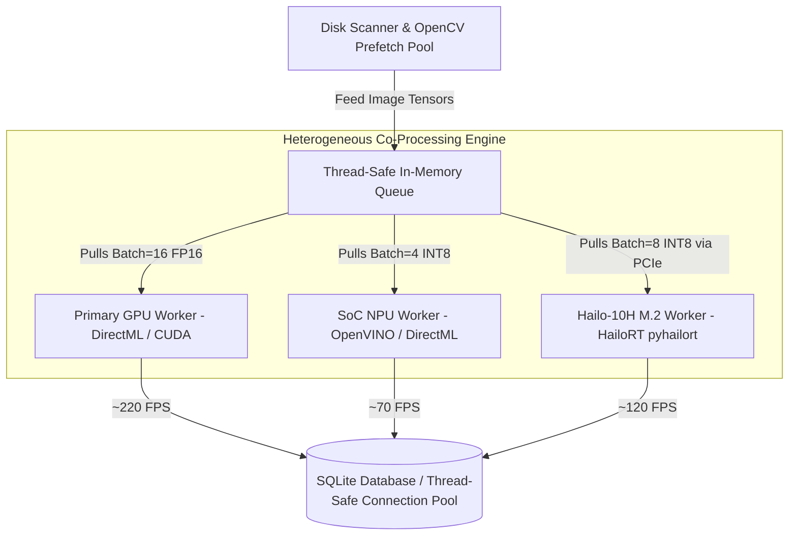

# Future Architecture Plan: NPU & Dedicated Edge AI Acceleration (GPU + NPU + Hailo-10H)

* **Target Version**: V.32+ (Next Major Milestone)
* **Document Status**: Proposed & Under Active Research
* **Recent Milestones**:
  * **V.30**: Danbooru Boolean Logic Engine (`AND`, `OR`, `NOT`, `NOR`), Strict Safety Filtering, and Lightbox Sizing Modes.
  * **V.31**: Universal Minimizable Dialogs (`MinimizableDialog`), Two-Way Windows Taskbar Sync, and Downloader Overhaul.
* **Target Hardware**: 
  * **Built-in NPUs**: Intel Core Ultra (Meteor Lake / Arrow Lake / Lunar Lake), AMD Ryzen AI (Phoenix / Hawk Point / Strix Point), Qualcomm Snapdragon X Elite, Windows 11 Copilot+ PCs.
  * **Dedicated M.2 Edge AI Coprocessors**: **Hailo-10H** M.2 PCIe Module (40 TOPS INT4 / 20 TOPS INT8, 4GB–8GB on-module LPDDR4X).

---

## 1. Executive Summary & Vision

PixKura currently leverages DirectX 12 DirectML to accelerate Vision AI tagging on modern GPUs (AMD Radeon, NVIDIA GeForce, Intel Arc), delivering high throughput (~200–290 FPS at Batch=16, FP16). 

With the emergence of Neural Processing Units (NPUs) and dedicated M.2 Edge AI accelerators like the **Hailo-10H**, client devices now have access to high-efficiency specialized neural compute units. This document details the architectural roadmap to:
1. **Leverage Built-in & Dedicated NPUs** for ultra-low-power, silent, and battery-friendly background tagging.
2. **Implement Heterogeneous Hybrid Computing (GPU + NPU / Hailo-10H)** to run dual or tri-engine accelerators concurrently, maximizing throughput while eliminating GPU resource contention.
3. **Enable Universal Edge AI Acceleration** for older desktops, mini-PCs, and NAS servers via plug-and-play M.2 PCIe accelerators.

---

## 2. Key Motivations & Hardware Comparison

| Hardware Platform | Compute Power | Typical TDP | Memory Architecture | Best Use Case in PixKura |
| :--- | :--- | :--- | :--- | :--- |
| **Discrete / Integrated GPU** | Up to 100+ TFLOPS | 30W – 250W+ | Shared System RAM or Dedicated VRAM | High-throughput batch indexing (Batch=16, FP16) |
| **Built-in SoC NPU** (Core Ultra / Ryzen AI) | 16 – 50 TOPS | 2W – 8W | Unified System Memory | Battery-friendly laptop tagging, zero GPU contention |
| **Hailo-10H M.2 Coprocessor** | 20 TOPS (INT8) / 40 TOPS (INT4) | **~2.5W – 3.5W** | **Dedicated On-Module 4GB/8GB LPDDR4X** | 24/7 Home Server tagging, zero host RAM/VRAM footprint, upgrades any PC with an M.2 slot |

---

## 3. Key Benefits of Dedicated Edge AI (Hailo-10H)

1. **Zero Host RAM & VRAM Contention**:
   * The Hailo-10H contains **4GB or 8GB of dedicated LPDDR4X memory** soldered directly on the M.2 module.
   * Model weights, runtime intermediate activation buffers, and computation graphs reside entirely on the module, consuming **0 MB** of host system RAM and **0 MB** of GPU VRAM.
2. **Universal Compatibility for Legacy & Mini PCs**:
   * Users do not need to upgrade to expensive new CPU platforms (Intel Core Ultra or AMD Ryzen AI).
   * Any desktop, compact SFF PC, or home server with a spare **M.2 Key M (2242 / 2280) PCIe Gen 3.0 x4** slot can immediately gain 20–40 TOPS of dedicated AI compute.
3. **Extreme Energy Efficiency for 24/7 Operations**:
   * Consuming only **~2.5W**, a mini-PC or NAS running PixKura can continuously scan, index, and tag newly downloaded illustrations 24/7 silently with virtually zero impact on the electricity bill.

---

## 4. Core Architectural Strategies

### Strategy A: Dynamic Dual/Tri-Worker Pipeline (Split-Load Concurrent Inference)

A thread-safe in-memory queue feeds work packages dynamically across heterogeneous hardware backends:



* **GPU Worker**: Focuses on maximum raw throughput (`batch_size=16`, FP16 half-precision) using `DmlExecutionProvider`.
* **SoC NPU Worker**: Handles continuous background batches (`batch_size=4`, INT8 quantization).
* **Hailo-10H Worker**: Operates via PCIe DMA using the native `pyhailort` pipeline, processing images directly in its on-module memory.
* **Auto-Load Balancing**: Each worker pulls from the shared queue only when ready, preventing bottlenecks regardless of hardware speed differences.

---

### Strategy B: Model-Level Parallelism for 3-in-1 Ensemble

In the **WD Tagger v3 Ensemble (3-in-1)** mode, all three vision models (`ConvNeXt`, `ViT`, `SwinV2`) can be distributed across physical hardware devices:

* **Primary GPU**: Executes `WD Tagger v3 SwinV2` (heavy transformer attention compute).
* **Hailo-10H M.2**: Executes `WD14 / WD v3 ConvNeXt` (convolution-heavy dataflow architecture achieves near 100% compute efficiency).
* **SoC NPU / CPU**: Executes `WD Tagger v3 ViT`.
* **Outcome**: True simultaneous hardware execution with 0% VRAM bottlenecks and aggregated ensemble soft-voting.

---

### Strategy C: Real-Time Ingestion Tagging (Download-to-Tag Pipeline)

When downloading artworks via the built-in Pixiv Downloader:
* Send newly downloaded images directly to the **Hailo-10H M.2 worker** for immediate tagging.
* The main GPU remains 100% idle and available for games, 3D rendering, or video playback.

---

## 5. Technical Stack & Execution Providers

### 5.1. Built-in SoC NPU Stack

```
                       ┌──► Windows 11 Copilot+ (DirectML MCDM Driver) ──► DmlExecutionProvider(device_id=NPU)
                       │
ONNX Runtime NPU ──────┼──► Intel Core Ultra (Meteor/Arrow/Lunar Lake) ──► OpenVINOExecutionProvider(device_type='NPU')
                       │
                       ├──► AMD Ryzen AI (Phoenix/Hawk/Strix Point) ─────► VitisAIExecutionProvider
                       │
                       └──► Qualcomm Snapdragon X Elite ────────────────► QNNExecutionProvider
```

### 5.2. Hailo-10H Dedicated M.2 Stack

Hailo devices utilize a **Dataflow Architecture**. Models are compiled once offline into **Hailo Executable Format (`.hef`)** and executed through **HailoRT**:

```
[WD14 ConvNeXt ONNX Model]
            │
            ▼ (Hailo Dataflow Compiler / DFC on WSL2 or Docker)
[wd14_convnextv2.hef (INT8 / Quantized Dataflow Graph)]
            │
            ▼ (Windows Host Runtime)
[Python tagger.py] ──► [HailoRT / pyhailort API] ──► [PCIe Gen3 x4] ──► [Hailo-10H M.2 Hardware]
```

#### Hailo Python Integration Snippet:
```python
from hailo_platform import VDevice, InferModel, FormatType

class HailoTaggerWorker:
    def __init__(self, hef_path: str):
        # Initialize virtual device targeting the Hailo-10H M.2 module
        self.vdevice = VDevice()
        self.infer_model = self.vdevice.create_infer_model(hef_path)
        self.infer_model.input().set_format_type(FormatType.UINT8)
        self.infer_model.output().set_format_type(FormatType.FLOAT32)
        self.configured_model = self.infer_model.configure()

    def predict_batch(self, image_batch):
        # Zero-copy async DMA transfer over PCIe directly to Hailo on-module RAM
        bindings = self.configured_model.create_bindings()
        bindings.input().set_buffer(image_batch)
        self.configured_model.run([bindings], timeout_ms=1000)
        return bindings.output().get_buffer()
```

---

## 6. Model Optimization & Architecture Compatibility

| Vision Model Architecture | DirectML GPU | Built-in SoC NPU | Hailo-10H M.2 Coprocessor |
| :--- | :---: | :---: | :---: |
| **WD14 ConvNeXt v2** (Pure CNN) | ⭐⭐⭐⭐⭐ (Fastest FP16) | ⭐⭐⭐⭐⭐ (Ideal for INT8) | 👑 **Optimal** (Dataflow CNN mapping, maximum FPS/Watt) |
| **WD Tagger v3 ViT** (Standard Transformer) | ⭐⭐⭐⭐ (High VRAM) | ⭐⭐⭐ (Requires Attention Ops) | ⭐⭐⭐⭐ (Supported with INT8 calibration) |
| **WD Tagger v3 SwinV2** (Shifted Windows) | ⭐⭐⭐⭐⭐ (DirectML) | ⭐⭐ (Complex dynamic ops) | ⭐⭐⭐ (Compiles via DFC with static shape) |

---

## 7. Implementation Roadmap

### Phase 1: Hardware Discovery & Enumeration
- [ ] Implement NPU detection in `utils.py` (querying Windows WMI `Win32_PnPEntity` and DirectML MCDM compute adapters).
- [ ] Implement Hailo PCIe device detection (`hailortcli scan` / `hailo_platform.Device.scan()`).
- [ ] Display detected hardware accelerators in the AI Tag Dialog.

### Phase 2: Standalone Proof-of-Concept
- [ ] Export static INT8 ONNX model for `WD14 ConvNeXt v2`.
- [ ] Compile `wd14_convnextv2.hef` using the Hailo Dataflow Compiler (DFC).
- [ ] Benchmark standalone inference FPS and power draw across GPU vs NPU vs Hailo-10H.

### Phase 3: Heterogeneous Co-Processing Engine
- [ ] Implement thread-safe producer-consumer queue in `workers.py`.
- [ ] Support dual-accelerator pairing: `GPU + NPU` or `GPU + Hailo-10H`.
- [ ] Measure aggregated FPS scaling and verify zero SQLite lock contention.

### Phase 4: UI & Mode Selector
- [ ] Add Hardware Acceleration Selector in `ai_tag_dialog.py`:
  * `Auto (Smart Selection)`
  * `GPU Only (DirectML)`
  * `NPU Only (Eco & Battery Friendly)`
  * `Hailo-10H (Dedicated M.2 Edge AI - 2.5W)`
  * `⚡ Hybrid Co-Processing (GPU + NPU / Hailo)`
- [ ] Add real-time hardware status indicators (GPU FPS / NPU FPS / Hailo FPS).
